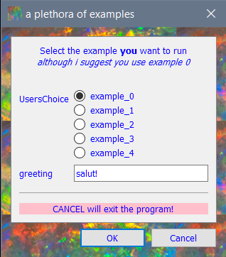
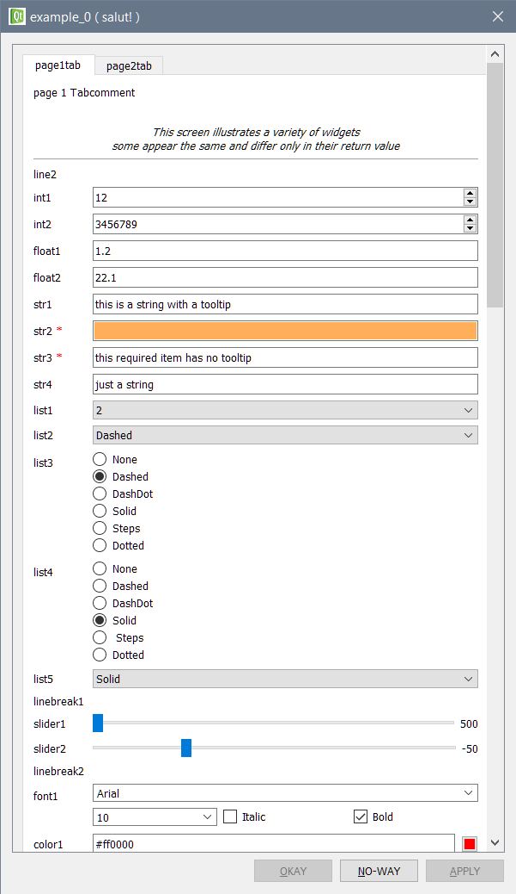

# formlayout
Python module providing the most easy way to create Qt form dialogs and widgets




With ``formlayout``, generating a form is very easy:
  * To show a dialog box, just call the ``fedit`` function.
  * To set-up the form dialog, simply use lists to pass parameters (field names, default values, ...).
  * To embedd ``formlayout`` in your own library, just copy the ``formlayout`` autoconsistent single script (*zero dependency*, except Qt itself).

See [documentation](https://formlayout.readthedocs.io/en/latest/) for more details 
(mostly examples) on the library and [changelog](CHANGELOG.md) for recent 
history of changes.

## Overview

Graphical user interface (GUI) libraries are usually designed to address issues 
which are far more complex than a simple dialog box. As a consequence, generating 
simple form layouts or dialogs is generally not as easy as it should be: the 
feature-line count ratio is very low for the most simple dialog boxes.

Within this context, ``formlayout`` provides the absolute minimum API required 
to create form dialog boxes (or layouts). To show a dialog box, simply call 
the ``fedit`` function. To set-up the dialog box, just use lists to pass the 
required parameters (field names, default values, ...).

## Simple Example

With ``formlayout``, generating a form is very easy.
Here is a simple example (more are included in source package):

```python
from formlayout import fedit
datalist = [('Name', 'Paul'),
            (None, None),
            (None, 'Information:'),
            ('Age', 30),
            ('Sex', [0, 'Male', 'Female']),
            ('Size', 12.1),
            ('Eyes', 'green'),
            ('Married', True),
            ]
fedit(datalist, title="Describe yourself", comment="This is just an <b>example</b>.")
```

## Installation

The only requirements are Python3+ and PySide2:
- Python >=3.2
- PySide2

